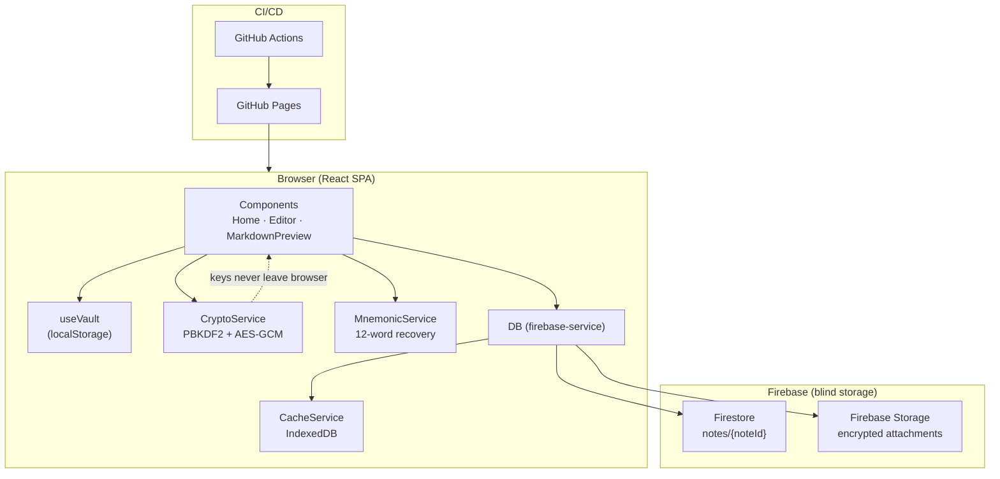
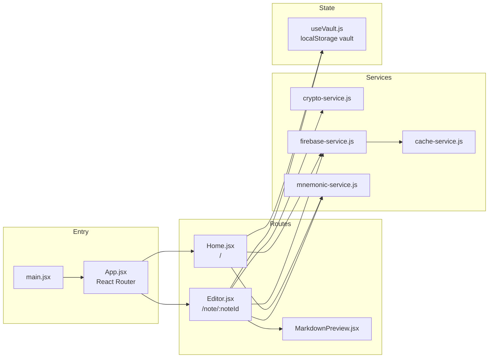
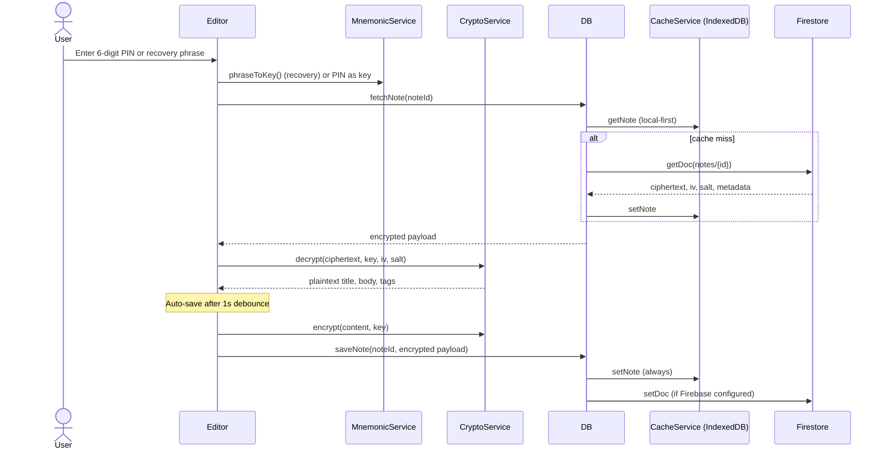
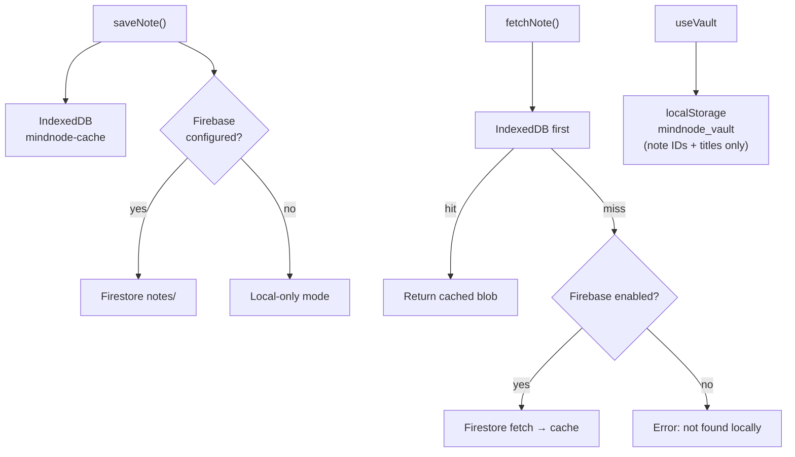

# Architecture Design

## 1. Overview

Lorapok MindNode implements a **zero-knowledge** architecture. Firebase acts as blind storage: it never receives keys or plaintext. Encryption and decryption happen entirely in the browser via the Web Crypto API.

## 2. High-Level System



## 3. Frontend Module Map



## 4. Security Model (End-to-End Encryption)

### 4.1 Cryptographic Pipeline

Uses the **Web Crypto API** (no third-party crypto libraries).

**Encryption flow:**

1. **Key derivation**: User supplies a secret key. `PBKDF2` with a random `salt` and 100,000 SHA-256 iterations derives a 256-bit symmetric key.
2. **Cipher**: Note content is encrypted with **AES-GCM**.
3. **Payload** stored in Firestore / IndexedDB:
   - `ciphertext` — encrypted content (Base64)
   - `iv` — initialization vector (unique per save)
   - `salt` — key-derivation salt

**Decryption flow:**

1. Fetch `ciphertext`, `iv`, and `salt` by `noteId`.
2. Derive the symmetric key from the secret key and `salt`.
3. Decrypt with AES-GCM; wrong keys fail the authentication tag check.

### 4.2 Access Control (Recovery phrase + 6-digit PIN)

Access is **note ID + credentials**, not user accounts.

| Phase | Credential | Purpose |
|-------|------------|---------|
| First-time setup | 12-word recovery phrase | Required to create a note; backs up access |
| PIN setup | 6-digit PIN (any digits) | Encrypts note content for daily use |
| Daily unlock | 6-digit PIN | Fast unlock and auto-save |
| Recovery | 12-word recovery phrase | Restores PIN via `recoverySeal` if PIN is forgotten |

The note body is encrypted with the **PIN**. The recovery phrase encrypts a sealed copy of the PIN (`recoverySeal`) so recovery never stores the PIN in plaintext on the server.

- Routes: `/` (home), `/note/:noteId` (editor)
- `pinEnabled` and `recoverySeal` are stored as metadata alongside ciphertext (not secret)

## 5. Encrypt / Decrypt Data Flow



## 6. Persistence (Local-First)



## 7. Data Model (Firestore)

**Collection: `notes`**

| Field | Description |
|-------|-------------|
| `id` | Document ID (note identifier) |
| `ciphertext`, `iv`, `salt` | Encrypted body |
| `encryptedTitle` | Encrypted title blob |
| `encryptedTags` | Encrypted tags blob |
| `attachments` | Encrypted file metadata + Storage URLs |
| `pinEnabled` | `true` after 6-digit PIN setup |
| `recoverySeal` | PIN encrypted with recovery phrase (for PIN recovery) |
| `ttl` | Optional self-destruct hours |
| `updatedAt` | ISO timestamp |

## 8. Repository Layout

| Path | Role |
|------|------|
| `src/main.jsx` | React bootstrap |
| `src/App.jsx` | Routes: `/`, `/note/:noteId` |
| `src/components/` | Home, Editor, MarkdownPreview, HowToUseModal |
| `src/services/` | Crypto, Firebase, IndexedDB cache, mnemonics |
| `src/hooks/useVault.js` | Recent-note bookmarks (IDs/titles only) |
| `public/sw.js` | Service worker for offline assets |
| `.github/workflows/deploy.yml` | Build and deploy to GitHub Pages |

## 9. Deployment Pipeline

- **CI/CD**: GitHub Actions on push to `main`.
- **Secrets**: GitHub Secrets → Vite env vars (`VITE_FIREBASE_*`) → production bundle.
- **Hosting**: GitHub Pages.

## 10. Firebase Rules

| File | Purpose |
|------|---------|
| `firestore.rules` | `notes/{noteId}` read/write with ciphertext validation |
| `storage.rules` | `notes/{noteId}/{fileName}` for encrypted attachments |
| `firebase.json` | Wires rules for `firebase deploy` |
| `firebase-rules.txt` | Deploy instructions (pointer) |

```bash
firebase deploy --only firestore:rules,storage
```

Rules allow unauthenticated access to `notes/*` (key-based app) but reject malformed documents and all other paths. Encryption remains the real access control.
