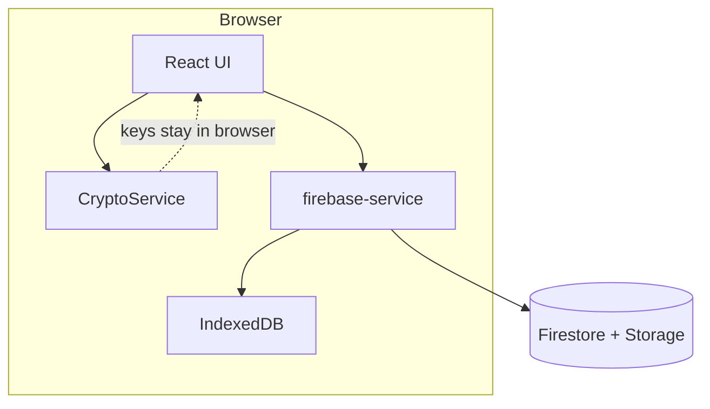

# Lorapok MindNode

A high-security, key-based digital notepad with end-to-end encryption. No accounts, no server-side keys—your notes are encrypted in the browser before they ever leave your device.

## Key Features

- **Zero-knowledge security**: Client-side encryption via Web Crypto API (PBKDF2 + AES-GCM).
- **Key-based access**: Open notes with a Note ID and a secret key you define.
- **Recovery phrases**: 12-word mnemonic phrases as an alternative to a secret key.
- **Local-first**: IndexedDB cache for fast reads and offline use after load.
- **PWA-ready**: Service worker and manifest for installable, offline-capable use.
- **Markdown editor**: Distraction-free writing with live preview and auto-save.
- **Secure sharing**: Share the note URL; recipients need the same secret key to decrypt.

## Tech Stack

| Layer | Technology |
|-------|------------|
| Frontend | React 18, Vite, Tailwind CSS, Framer Motion |
| Storage | Firebase Firestore, Firebase Storage, IndexedDB |
| Crypto | Web Crypto API (PBKDF2, AES-GCM) |
| Deploy | GitHub Actions → GitHub Pages |

## Architecture (at a glance)



For full diagrams (module map, sequence flows, persistence), see [ARCHITECTURE.md](./ARCHITECTURE.md).

## Getting Started

### 1. Install and run

```bash
git clone https://github.com/Maijied/Lorapok-MindNode.git
cd Lorapok-MindNode
npm install
npm run dev
```

### 2. Environment variables

Copy `.env.example` to `.env` and set your Firebase project values:

```env
VITE_FIREBASE_API_KEY=your_api_key
VITE_FIREBASE_AUTH_DOMAIN=your_auth_domain
VITE_FIREBASE_PROJECT_ID=your_project_id
VITE_FIREBASE_STORAGE_BUCKET=your_storage_bucket
VITE_FIREBASE_MESSAGING_SENDER_ID=your_sender_id
VITE_FIREBASE_APP_ID=your_app_id
```

Without Firebase config, the app runs in **local-only mode** (IndexedDB only; attachments require Firebase Storage).

### 3. Build

```bash
npm run build
```

### 4. Deploy

Push to the `main` branch. GitHub Actions builds with injected secrets and deploys to GitHub Pages.

## Project structure

```
src/
├── main.jsx              # Entry point
├── App.jsx               # Router
├── components/
│   ├── Home.jsx          # Landing + vault
│   ├── Editor.jsx        # Note editor
│   └── MarkdownPreview.jsx
├── hooks/
│   └── useVault.js       # localStorage note bookmarks
└── services/
    ├── crypto-service.js
    ├── firebase-service.js
    ├── cache-service.js
    └── mnemonic-service.js
```

---

*Designed for privacy. Built for speed.*
